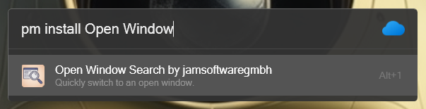

  
  &nbsp;&nbsp;&nbsp;&nbsp;
  

# OpenWindowSearch - Flow Launcher Plugin

  

A [Flow Launcher](https://github.com/Flow-Launcher/Flow.Launcher) plugin to search through all open windows and and activate them.

## Installation

### Flow Launcher

To install, type `pm install Open Window Search` into Flow Launcher.

## Manual Installation

Extract Flow.Launcher.Plugin.OpenWindowSearch.zip to Flow Launcher's plugin directory.

| Flow Launcher Mode | Plugin Directory Path |
|--------------------|----------------------|
| Standard           | `%appdata%\FlowLauncher\Plugins` |
| Portable           | `<YourPortableLocation>\FlowLauncher\app-<VersionOfYourFlowLauncher>\UserData\Plugins` |